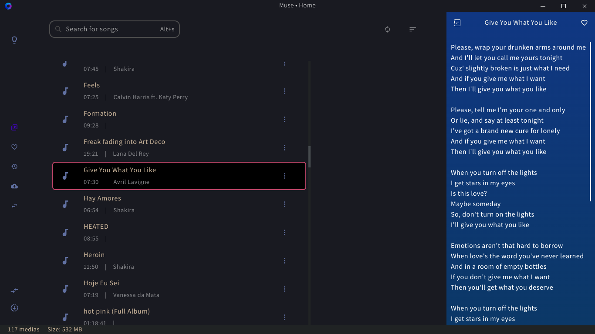

# Muse

<h1 align="center">
 
</h1>

> Just a simple, Electron-React app, to download audio from YouTube and play them.

## Table of contents

- [Technologies](#🛠_Technologies)
- [Features](#Features)
- [Installing](#🚀_Installing)
- [Requirements](#💻_Requirements)
- [Contributing](#📫_Contributing)
- [Author](#Author)
- [License](#📝_License)

## Screenshots

<h1 align="center">
  
</h1>

<h1 align="center">
  
</h1>

<h1 align="center">
  
</h1>

### 🛠 Technologies

The following tools were used in this project construction:

- [Koa](https://koajs.com/)
- [Vite](https://vitejs.dev/)
- [Rome](https://rome.tools/)
- [Tauri](https://tauri.app/)
- [Vitest](https://vitest.dev/)
- [React](https://pt-br.reactjs.org/)
- [Tailwind](https://tailwindcss.com/)
- [Zustand](https://github.com/pmndrs/zustand)
- [TypeScript](https://www.typescriptlang.org/)
- [Ytdl Core](https://github.com/fent/node-ytdl-core)
- [React Icons](https://react-icons.github.io/react-icons/)
- [Node TagLib Sharp](https://github.com/benrr101/node-taglib-sharp)
- [Fluent FFmpeg](https://github.com/fluent-ffmpeg/node-fluent-ffmpeg)

## Features

- Copy an URL and see a message asking if you want to download
  an 'mp3' version of the media.
  📫
- Share media with devices on the same WiFi network.

- Get the media's lyrics.

- App auto-updates when a new version is available.

## 🚀 Installing

To install and run Muse, follow these steps:

- Linux  
  Download 'Muse-**_version_**.AppImage' from the releases page;
  Once downloaded, you need to make it an executable. On your terminal, run `chmod a+x Muse-*.AppImage`.
  Now you can run Muse: `./Muse-*.AppImage`

## Develop

To install and run Muse, follow these steps:

```sh
git clone https://github.com/Gabriel-Alves-Cunha/muse --depth 1
```

```sh
# Install dependencies
yarn
# Start app:
yarn dev
```

## 💻 Requirements

For development, before everything, verify that:

- You have the most recent (LTS) version of `git`, `Node.JS` and `yarn`

## 📫 Contributing

To contribute to Muse, follow these steps:

1. Fork this repo.
2. Create a branch: `git checkout -b <my_branch_name>`.
3. Make your alterations e confirm them: `git commit -am '<commit_message>'`
4. Send to the original branch: `git push origin <my_branch_name>`
5. Create a pull request.

As an alternative, consult the docs from GitHub on [how to create a pull request](https://help.github.com/en/github/collaborating-with-issues-and-pull-requests/creating-a-pull-request).

### Author

---

<a href="https://github.com/Gabriel-Alves-Cunha/">
  

  <br />

  <sub>
    <b>Gabriel Alves Cunha</b>
  </sub>
</a>

<a href="https://blog.rocketseat.com.br/author/thiago//" title="Rocketseat">🚀</a>

Made with ❤️ by Gabriel Alves Cunha 👋🏽!

[](https://www.linkedin.com/in/gabriel-alves-cunha-214178174/)
[](mailto:gabriel925486@gmail.com)

## 📝 License

This project is under the MIT license. See the [LICENCE](LICENCE) for more details.
