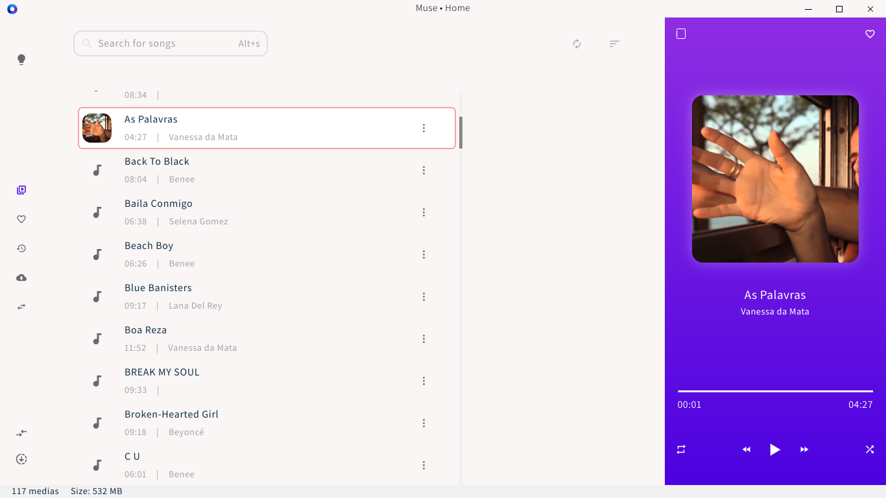
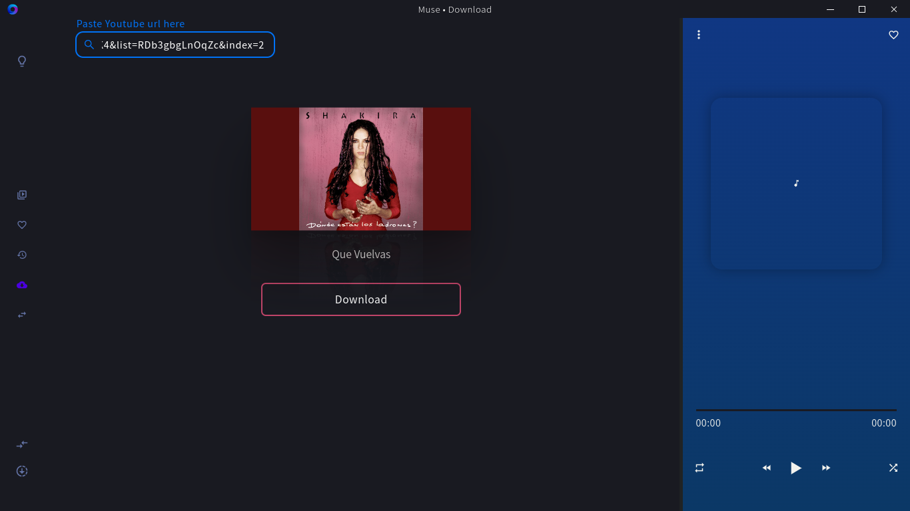

# Muse

<h1 align="center">
	
</h1>

> Just a simple Electron-React app to download audio from Youtube and play them.

## Table of contents

- [Layout](#Layout)
- [Tecnologies](#Tecnologies)
- [Requirements](#Requirements)
- [Installing](#Installing)
- [Contributing](#Contributing)
- [Author](#Author)
- [License](#License)

<h4 align="center">
	🚧  React - Electron 🚀 Building...  🚧
</h4>

## Screenshots

<h1 align="center">
  
</h1>

<h1 align="center">
  
</h1>

<!-- ## Features

- [x] Companies or entities can register on the web platform by sending:

  - [x] an image of the collection point
  - [x] entity name, email and whatsapp
  - [x] and the address so that it can appear on the map
  - [x] in addition to selecting one or more collection items:
    - lamps
    - Batteries
    - papers and cardboard
    - electronic waste
    - organic waste
    - kitchen oil

- [x] Users have access to the mobile application, where they can:
  - [x] browse the map to see the registered institutions
  - [x] contact the entity via E-mail or WhatsApp -->

### 🛠 Tecnologies

The following tools were used on this project construction:

- [Vite](https://vitejs.dev/)
- [Vitest](https://vitest.dev/)
- [Stitches](https://stitches.dev/)
- [Node.js](https://nodejs.org/en/)
- [React](https://pt-br.reactjs.org/)
- [Electron](https://www.electronjs.org/)
- [Zustand](https://github.com/pmndrs/zustand)
- [TypeScript](https://www.typescriptlang.org/)
- [Ytdl Core](https://github.com/fent/node-ytdl-core)
- [React Icons](https://react-icons.github.io/react-icons/)
- [Node TagLib Sharp](https://github.com/benrr101/node-taglib-sharp)
- [Fluent Ffmpeg](https://github.com/fluent-ffmpeg/node-fluent-ffmpeg)

## 💻 Requirements

Before everything, verify that:

- You have the most recent (LTS) version of `git`, `Node.JS` and `yarn`

## 🚀 Installing

To install and run Muse, follow these steps:

```bash
git clone https://github.com/Gabriel-Alves-Cunha/muse
```

```bash
yarn
```

```bash
yarn dist
```

Then the binary will be inside the `dist/` folder.

To start local development:

```shell
# We use esbuild to compile the main process Typescript, which is faster
yarn dev
```

## 📫 Contributing

To contribute with Muse, follow these steps:

1. Fork this repo.
2. Create a branch: `git checkout -b <my_branch_name>`.
3. Make your alterations e confirm them: `git commit -am '<commit_message>'`
4. Send to the original branch: `git push origin <my_branch_name>`
5. Create a pull request.

As an alternative, consult the docs from GitHub on [how to create a pull request](https://help.github.com/en/github/collaborating-with-issues-and-pull-requests/creating-a-pull-request).

### Author

---

<a href="https://github.com/Gabriel-Alves-Cunha/">
  
  <br />
  <sub>
    <b>Gabriel Alves Cunha</b>
  </sub>
</a>
<a href="https://blog.rocketseat.com.br/author/thiago//" title="Rocketseat">🚀</a>

Made with ❤️ by Gabriel Alves Cunha 👋🏽!

[](https://www.linkedin.com/in/gabriel-alves-cunha-214178174/)
[](mailto:gabriel925486@gmail.com)

## 📝 License

This project is under the MIT license. See the [LICENCE](LICENCE) for more details.
